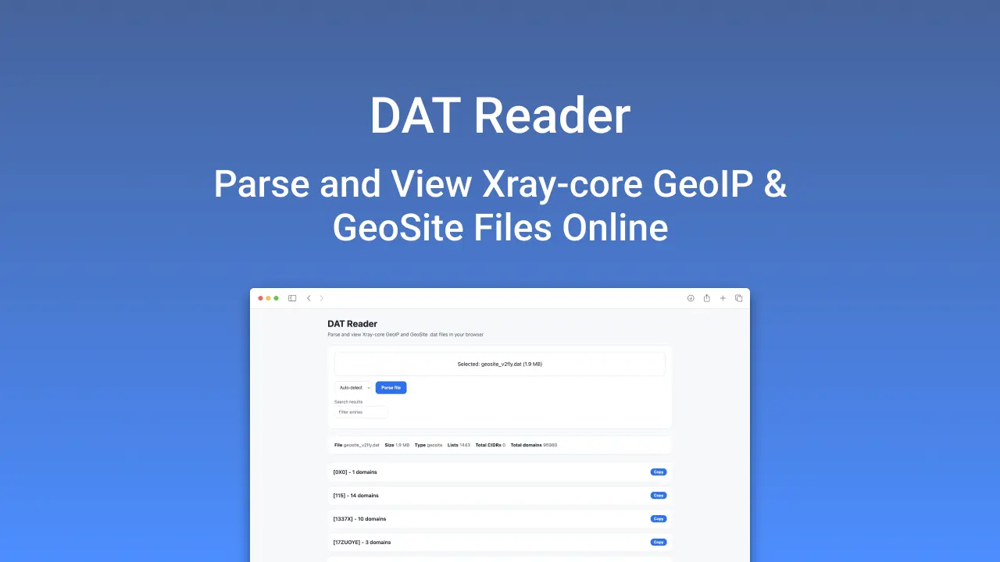

# DAT Reader


A client-side web tool for parsing and viewing Xray-core GeoIP and GeoSite `.dat` files directly in the browser.

[Xray-core](https://github.com/XTLS/Xray-core) uses binary `.dat` files to store GeoIP (IP ranges by country) and GeoSite (domain rules by category) data for routing. This app lets you open those files, browse entries by tag, search and filter, and copy tags in the format Xray expects (`ext:filename:tag`) — useful when writing or debugging routing rules. All processing runs in your browser; nothing is sent to a server.

## Features

- Drag-and-drop or file picker for `.dat` files
- Auto-detects GeoIP vs GeoSite format (or manual selection)
- Search and filter entries by tag name or content
- Copy entry tags in Xray route format (`ext:filename:tag`)
- Dark/light theme based on system preference
- Installable as a PWA

## Tech Stack

TypeScript, Vite, protobufjs, Web Workers.

## Development

```bash
npm install          # Install dependencies
npm run dev          # Start dev server at http://localhost:5173
npm run build        # Production build
npm run format       # Format code with Prettier
npm run lint:ts      # Type-check with tsc
```

## Docker

```bash
docker build -t dat-reader-web .
docker run -p 8080:80 dat-reader-web
```

Or using Docker Compose:

```bash
docker compose up
```

The app will be available at `http://localhost:8080`.

## License

MIT
